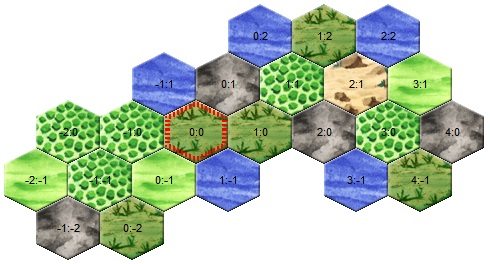

Die Welt
========

Die Landschaft von Eressea
--------------------------

	Ruhig blickte Selen Ard'Ragorn zur Tür, als Rahel, ihre junge Novizin,
	unbeholfen in die kleine Kammer im Bibliotheksflügel des Tempels hinein
	stolperte. Leicht amüsiert betrachtete sie den etwas nervös umherzuckenden
	Schwanz der jungen Katze, die sich ebenso verzweifelt wie erfolglos bemühte,
	ihr in Unordnung geratenes Gewand zu glätten.

	"Komm näher, Kind", bat Selen, und etwas schüchtern näherte sich Rahel dem
	goldintarsiengeschmückten Tisch, an dem die Tempelvorsteherin Platz genommen
	hatte. Als die Augen der Jungkatze über das große Pergament glitten, welches
	ausgebreitet darauf lag, maunzte sie erstaunt auf. Auf dem Tisch lag eine
	feinsäuberlich gezeichnete Karte der ganzen bekannten Welt. Informationen aus
	allen im Blick der Goldäugigen Katze liegenden Ländern waren zusammengetragen
	und von geschickten Händen in dieser Karte eingetragen worden. Rahel erkannte
	Andune in der Mitte, die kleine, fast zweigeteilte Insel inmitten des Meeres.
	Um Andune herum sah sie die bekannten Konturen der Nachbarinseln, wie Andune
	selbst eingebettet in den unendlich scheinenden Ozean.

Die Welt von Eressea besteht aus einer Vielzahl von Inseln und Kontinenten von
ganz unterschiedlicher Größe. Inseln wie Ozeane sind unterteilt in Regionen. In
den Regionen findet man die Einheiten der Spieler, Gebäude und Schiffe, die
Bauern und verschiedene Rohstoffe. 

	Rahel betrachtete noch verblüfft die eigentlich geheime Karte, als Selen mit
	dem Finger auf eine der Inseln ganz am Rande deutete. "Sieh, Rahel. Dort ist
	eine Insel, die gerade erst eingetragen wurde. Erkennst du, wie unsere
	Kartographen arbeiten?" 



	Angestrengt betrachtete die Novizin die Karte. Offenbar hatte man sich bei ihrer
	Erstellung auf das wesentliche beschränkt und die entdeckten Landstriche nur
	grob klassifiziert. Rahel erkannte Wälder und Gebirge, viele Sümpfe und einige
	unbewaldete Ebenen.

In diesem Beispiel ist bei (0,0) ein Sumpf, nordöstlich davon bei (0,1) ein
Gebirge. Jede Partei in Eressea hat ein eigenes Koordinatensystem, welches mit
dem Befehl URSPRUNG verschoben werden kann, beispielsweise, um es an das einer
anderen Partei anzugleichen.

	"Gut, mein Kind", bestätigte Selen die um so vieles jüngere Katze. "Solche
	Karten dienen vor allem der Navigation unserer Schiffe. Wie du aber sicher
	leicht einsiehst, enthalten sie nicht sehr viele Informationen. Deshalb ..." -
	und mit diesen Worten schlug Selen ein großes schweres Buch auf, welches neben
	der Karte auf dem Tisch gelegen hatte, - "... deshalb bekommen wir von jedem
	unserer Kundschafter jede Woche einen ausführlichen Bericht über die
	erforschten Regionen. Wir sammeln diese Berichte, denn sie helfen uns sehr bei
	unseren Entscheidungen."

In der Welt von Eressea gibt es verschiedene Geländearten (Berge, Ebene, Wald,
Gletscher, Hochland, Sumpf, Wüste und Vulkan) mit unterschiedlichen
Eigenschaften. Ein Forschungsreisender, der die weiten Ozeane nicht scheut, wird
auf seinen Erkundungsreisen eventuell noch andere, exotische Regionstypen
entdecken. Als ein Beispiel sei hier nur die "Feuerwand" erwähnt, die ein
unüberwindbares Hindernis darstellt. Feuerwände grenzen in der Regel die Welten
in Eressea ab. Damit soll verhindert werden, dass Parteien sehr
unterschiedlichen Alters leicht aufeinander treffen.

Abhängig von der Geländeart werden in der Region unterschiedlich viele Bauern
Platz finden um auf den Feldern ihren wöchentlichen Lohn zu erwirtschaften. So
bietet eine Ebene deutlich mehr Bauern einen Arbeitsplatz, als zum Beispiel ein
Sumpf. Des Weiteren wird die Anzahl der verfügbaren Arbeitsplätze durch Bäume
reduziert. Jeder Bauer nimmt einen, jeder Schössling vier und jeder Baum acht
Arbeitsplätze weg. Zwar können in jeder Geländeart nahezu endlos viele Bäume
wachsen, in einer sehr bewaldeten Region wird es dann nur so gut wie keine
Arbeitsplätze mehr geben. In einem Gletscher reichen sehr wenige Bäume aus um
fast alle Arbeitsplätze zu belegen, in einer Ebene können einige Hundert Bäume
stehen und dennoch ein paar Tausend Bauern auf den Feldern arbeiten. Doch selbst
eine sehr dicht bewaldete Region wirft für einige wenige Bauern noch genügend
Früchte, Wurzeln oder Pilze ab, um davon leben zu können. Dadurch findet ein
kleiner Teil Bauern immer einer Arbeitsplatz in der Region: 10% der maximalen
Anzahl Arbeitsplätze in einer Region, jedoch nicht mehr als 200, werden daher
nie von Bäumen oder Schösslingen blockiert. Ein Berg in dem beispielsweise 150
Bäume stehen, finden also noch 100 Bauern einen Arbeitsplatz (10% der maximalen
Anzahl Arbeitsplätze), obwohl durch die vielen Bäume eigentlich keine
Arbeitsplätze mehr vorhanden sind (150 Bäume x 8 belegte Arbeitsplätze = 1200
belegte Arbeitsplätze > 1000 maximal verfügbare Arbeitsplätze).

Der einzige Unterschied zwischen einer Ebene und einem Wald ist die Anzahl Bäume
und Schösslinge in der Region. Ab einer Gesamtzahl von 600 Bäumen und/oder
Schösslingen gilt eine Ebene als Wald. So kann man durch Holzfällen einen Wald
zu einer Ebene machen oder umgekehrt durch Aufforsten eine Ebene in einen Wald
verwandeln. 

.. csv-table::
  :file: tables/terrains.csv
  :header-rows: 1

Wird die Zahl vorhandener Arbeitsplätze überschritten, wird es für die Bauern
sehr schwierig den benötigen Wochenlohn zu erwirtschaften - auch Bauern brauchen
jede Runde 10 Silber um zu überleben, die sie durch Arbeit verdienen. Größere
Burgen geben zwar einen kleinen Bonus auf den Silberverdienst durch Arbeit in
der Region, so dass eventuell die arbeitenden Bauern einige andere Bauern der
Region mitversorgen können, aber das Risiko, dass Bauern sterben, zum Beispiel
durch eine Pest, steigt enorm, wenn die Anzahl der verfügbaren Arbeitsplätze
klein ist. Des Weiteren können auch keine Spieler-Einheiten in dieser Region
mehr arbeiten, sollten alle Arbeitsplätze belegt sein.

Die Geländeart legt außerdem fest, welche Kräuter in der Region wachsen können.
Ein Alchemist wird aus unterschiedlichen Zutaten hilfreiche Tränke brauen
können. Manche Kräuter gedeihen nur in Wüsten, andere brauchen das sumpfige
Klima eines Moors, so gibt es für jedes Terrain Kräuter, die nur dort wachsen
können. Das dort wachsende Kraut kann allerdings nicht verändert werden. Selbst
wenn alle Kräuter aus der Region gezupft wurden, kann nur das ursprünglich dort
wachsende Kraut wieder angepflanzt werden. Im Zweifelsfall muss man
ausprobieren, welches Kraut jemals hier gewachsen ist. In Vulkanen wachsen
generell keine Kräuter.

In jeder Region können Straßen gebaut werden. Die Kosten variieren je nach
Terrain. Außerdem ist Straßenbau in Gletschern, Sümpfen und Wüsten nur möglich,
wenn dort spezielle Gebäude stehen. 

Zusätzlich bestimmt die Geländeart, welche Ressourcen in der Region mit welcher
Chance vorkommen können. So findet man in Bergen und Gletschern, in denen bisher
keine Rohstoffe abgebaut wurden, stets Eisen und Steine bereits auf Abbaustufe
eins. Berge haben jedoch stets deutlich mehr Rohstoffe als ein Gletscher. In einem
Vulkan findet ein Steinbauer mit 50% Chance Steine auf Abbautiefe 1, ebenso wird
ein Bergbauer nur mit 50% Chance Eisen dort auf Stufe 1 finden. Ein Vulkan kann
also Steine und Eisen vergleichbar wie ein Berg liefern, oder nur eine der
beiden Ressourcen oder mit Pech auch gar keine. Der Abbau in einem Vulkan ist
aber natürlich ungleich gefährlicher, weil dieser von Zeit zu Zeit ausbrechen
kann und dann den Personen, die sich in der Region aufhalten, erheblichen
Schaden zufügen wird. Zusammengefasst kann man sich aber merken, dass man in
diesen drei Regionstypen (Berge, Gletscher und Vulkan) immer auf Stufe 1 Steine
und/oder Eisen finden wird - so es sie denn in der Region überhaupt gibt.

Doch auch andere Regionstypen (Ebene/Wald, Sumpf, Wüste, Hochland) können mit
einer gewissen Wahrscheinlichkeit Eisen und/oder Steine bieten. In diesen
Regionen muss der Geologe allerdings eventuell etwas erfahrener sein, da das
Vorkommen nicht generell auf Abbaustufe 1 vorhanden sein muss. So kann es sein,
das Eisen irgendwo auf Abbaustufe 1 bis 7 anfängt, Steine findet man auf
Abbaustufe 1 bis 4 - vorausgesetzt die Region hat diese Ressource. Dabei
nützlich zu wissen ist, dass ein Geologe immer doppelt so tiefe Abbauschichten
sieht, wie sein Talentwert beträgt. Zum Beispiel ein Bergbauer Stufe 3 sieht
eventuell vorhandenes Eisen bis zu einer maximalen Abbautiefe auf Schicht 6.

Im Umkehrschluss kann man also auch sagen, wenn ein Bergbauer Stufe 4 in einer
Ebene (in der bisher kein Eisen abgebaut wurde) kein Eisen sieht, dann gibt es
dort auch kein Eisen und der Bergbauer kann in einer anderen Region sein Glück
versuchen.

Neben Eisen und Steinen gibt es auch noch das deutlich seltenere Metall Laen.
Wenn ein Berg, Gletscher oder Vulkan Laen beheimatet, dann findet man es ab
Abbautiefe 7. In anderen Regionstypen kann man mit Glück auch Laen finden, dann
aber eventuell erst auf Abbaustufe 7 bis 10. Man benötigt also einen Geologen
mit Bergbau 5 um Laen in jeder Landregion ausschließen zu können. Wenn man
großes Glück hatte und eine Region mit Laen gefunden hat, benötigt man zum Abbau
allerdings noch ein Bergwerk. 

	Selen blickte zur jungen Katze Rahel, die sich offensichtlich bemühte sich all
	die Zahlen und Daten einzuprägen. "Rahel, mein Kind, Du musst Dir diese Zahlen
	nicht alle merken. Merke Dir lieber, dass Du sie hier in der Bibliothek
	jederzeit wirst nachschlagen können." Die junge Novizin versuchte gefasst zu
	gucken, Magistra Selen merkte ihr die Erleichterung aber an, sich die
	Informationen nicht alle sofort merken zu müssen. Selen fuhr dann fort "Man
	lernt aber nicht nur in den Akademien und Bibliotheken, sondern auch in den
	Tavernen. Denn dort trifft man vereinzelt Bergbauer bei einem Met, die sich
	Geschichten von einem noch selteneren Metall als Laen erzählen. Sie nennen es
	Adamantium. Es soll noch sehr viel seltener als Laen sein und nur die
	erfahrensten Bergbauer sollen es je gefunden haben. Aber aus diesem Metall
	können die besten Schmiede auch die besten Waffen und Rüstungen in ganz
	Eressea fertigen." 

Für die nachfolgende Region werden die Informationen ausführlich erläutert:

```
Vîpot (3,-4), Wüste, 0/1 Bäume, 22 Steine/3, 190 Bauern, 5765 Silber,
36 Pferde. 
```

Die Region trägt den Namen "Vîpot" und hat die Koordinaten (3,-4) vom URSPRUNG
der Partei aus gesehen. Ein anderer Spieler - mit einem anderen URSPRUNG - kennt
dieselbe Region unter demselben Namen aber mit anderen Koordinaten. Der
Regionstyp ist Wüste. In einer Wüste gibt es maximal 500 freie Arbeitsplätze. In
Vîpot leben aktuell 190 Bauern. Jeder Bauer verbraucht einen Arbeitsplatz.
Außerdem wächst hier ein Schössling, Bäume gibt es hier aktuell nicht. Der
Schössling verbraucht aktuell 4 Arbeitsplätze. Damit verbleiben aktuell in der
Region 306 freie Arbeitsplätze. 

In der Region leben 36 wilde Pferde. Pferde haben keinen Einfluss auf die
verfügbare Anzahl Arbeitsplätze. Mit dem Talent Pferdedressur kann man die
Pferde einfangen und zum Beispiel für den Transport von Waren benutzen oder
Kämpfer damit ausrüsten, die dann im Kampf den Pferdebonus bekommen können, wenn
sie mindestens Reiten 2 beherrschen.

Außerdem gibt es Steine in Vîpot, dies trifft nicht auf jede Wüste zu, kommt
aber ab und zu vor. Aktuell gibt es 22 Steine auf Abbaustufe 3. Um dieses
Steinvorkommen zu entdecken, ist ein Geologe mit mindestens Steinbau 2 nötig
(Hinweis: Mit Steinbau 2 kann man Steinvorkommen bis maximal Abbaustufe 4
sehen). Um tatsächlich Steine abzubauen, muss die Einheit jedoch Steinbau 3
beherrschen.

Man kann im Prinzip in jeder Landregion Straßen bauen, um die
Reisegeschwindigkeit über Land zu erhöhen. Für die Wüste Vîpot benötigt man 100
Steine um eine Straße in eine der 6 Himmelsrichtungen (W, NW, NO, O, SO, SW) zu
bauen. Außerdem muss in der Nachbarregion ebenfalls eine ausgebaute Straße in
Richtung Vîpot existieren, damit es eine geschlossene Straßenverbindung gibt. Da
es sich bei Vîpot aber um eine Wüste handelt benötigt man zusätzlich eine voll
ausgebaute Karawanserei. Eine Wüste ist also nicht unbedingt die erste Wahl um
ein Straßennetz zu erbauen, kann aber je nach Geographie der Insel auch hier
eine lohnende Investition sein.

Die Zeile beinhaltet zudem noch den aktuellen Stand des Regionssilbers. Dieser
Betrag ist wichtig um abschätzen zu können, wie es um die Versorgung der Bauern
steht und wie viel Silber Spielereinheiten hier durch Unterhaltung oder
Steuereintreiben verdienen können. 


Die Regionen Eresseas
---------------------

	Selen deutete auf die aufgeschlagene Seite. "Jetzt Du, Rahel, sieh dir diesen
	Bericht einmal an, und sag mir, was du siehst." Rahel sah nur einen Moment
	angestrengt hin, bevor sie begann. 

Im Report werden alle Regionen, in denen man eine Einheit hat, durch die man
gereist ist oder Ozean-Regionen, die man von einem Leuchtturm erblickt hat,
aufgeführt:

```
Tetos (-1,0), Ebene, 1042 Bauern, 73/5 Bäume, 10953 Silber, 132 Pferde. Im
Nordwesten der Region liegt der Wald von Faldorn (-2,1), im Nordosten die Ebene
von Litforuvys (-1,1), im Osten die Ebene von Tumyvesfod (0,0), im Südosten der
Sumpf von Titymovut (0,-1), im Südwesten die Ebene von Livedfir (-1,-1) und im
Westen das Gebirge von Nipevan (-2,0). 
```

	"Nun, zunächst findet sich dort der Name, unter dem die Region bei den
	Einheimischen bekannt ist, sowie ihre Position. Direkt dahinter hat der
	Kundschafter vermerkt, von welcher Beschaffenheit die Region ist. Auch die Zahl
	der dort lebenden Bauern und eine grobe Abschätzung ihres Reichtums ist dort zu
	finden. Und es ist auch vermerkt, wie viele Bäume und Reittiere in dem
	Landstrich gefunden wurden. Steine und Eisen wurden dort bisher nicht entdeckt." 

Die in der Region lebenden Bauern können mit dem Befehl REKRUTIERE in die eigene
Partei rekrutiert werden, die Bäume und Pferde mit dem Befehl MACHE
eingeschlagen bzw. gezähmt werden. 

	"Sehr gut, Rahel. Und was steht in den Zeilen darunter vermerkt?" 

```
Auf dem Markt wird für Weihrauch 4 Silber verlangt. Geboten wird für Balsam
12 Silber, für Gewürz 10 Silber, für Juwelen 21 Silber, für Myrrhe 15 Silber,
für Öl 12 Silber und für Seide 30 Silber.

Statistik für Tetos (-1,0):

Unterhaltung: max. 547 Silber
Lohn für Arbeit: 11 Silber
Rekrutieren: max. 26 Bauern
Luxusgüter zum angegebenen Preis: 10
Personen: 20
Pferde: 4 Holz: 13
Silber: 821
Schwerter: 2
```

	Stolz strahlte die junge Novizin ihre offenbar zufriedene Lehrerin an. "Dabei,
	Magistra, handelt um weitere Informationen, die unsere Kundschafter
	herausgefunden haben. Zunächst scheinen sie sich auf dem Markt umgesehen und
	die Preise notiert zu haben. In dem Abschnitt darunter ist vermerkt, wie viel
	Silber die Bewohner der Region für Schausteller und Musiker auszugeben bereit
	sind, wie viel man für einfache Arbeiten bekommt, wie viele Bauern bereit
	sind, sich einem Volk anzuschließen und wie viele Güter auf den Markt
	überhaupt für den oben angegebenen Preis verkauft werden. In den letzten
	Zeilen ist dann vermerkt, wie viele Personen unseres Volkes sich dort
	aufhalten, und was sie mit sich führen." 


Bei Luxusgüter steht die Anzahl von Luxusgütern, die zum "Listenpreis" (siehe
auch Handel), von den Bauern ver- bzw. gekauft werden. Werden mehr Güter
gehandelt, verändert sich der Preis, unter Umständen dauerhaft! Näheres dazu
siehe im Kapitel Handel. 

	"Ausgezeichnet, Rahel. Was du da vor dir siehst, ist ein vollständiger
	Bericht. Manchmal jedoch erhalten wir auch weniger umfassende Berichte, etwa,
	wenn ein Kundschafter lediglich in Eile durch eine Region hindurch geritten
	ist. Solch ausführliche Berichte wie diesen bekommen wir nur, wenn sich
	Angehörige unseres Volkes dort aufhalten."

	Selen deutete mit der Hand auf den Stuhl auf der anderen Seite des Tisches.
	"Du kannst dich jetzt setzen, mein Kind." Rahel ging zum Stuhl, nahm Platz,
	und gab ein kurzes Schnurren von sich, eine Mischung aus Zufriedenheit
	darüber, dass sie ihre Lehrerin offenbar nicht enttäuscht hatte, und Erwartung
	des noch Kommenden. Die Geweihte der Goldäugigen Katzen lehnte sich in ihrem
	Stuhl zurück und blickte Rahel einen Moment an. "Was du dort siehst, sind nur
	Zahlen. Nützliche Zahlen, die es wert sind, bewahrt zu werden, ja. Aber
	wichtig ist es auch, die Gesetze zu erforschen, die hinter diesen Zahlen
	stehen."

	Sie stand auf, griff in den Beutel, den sie unter dem Tisch platziert hatte,
	und zog ein weiteres Pergament hervor, welches sie auf dem Tisch über der Karte
	ausbreitete. Rahel blickte interessiert darauf, erkannte aber zunächst nur eine
	chaotische Zeichnung aus mehr oder weniger horizontalen Linien. Fragend blickte
	sie ihre Lehrerin an. "Was bedeutet das, Magistra?"

	"Das, mein Kind, ist ein Versuch, Naturgesetzen auf die Spur zu kommen. Jede
	Woche verändert sich die Zahl der Bäume, Bauern und Pferde in einer Region.
	Sie sterben, werden geboren oder suchen ihr Glück anderswo. Ich habe mich
	bemüht, herauszufinden, warum sie das tun, ohne sie jemals zu befragen." Die
	Geweihte lächelte in sich hinein. "Es scheint, als würde viel vom Platz
	abhängen, den es in einem Landstrich gibt. Bauern, Bäume und Pferde nehmen
	sich gegenseitig den Platz." Die Novizin deutete auf eine an den Rand des
	Pergaments gekritzelte zweite kleine Zeichnung. "Und was bedeutet diese
	Zeichnung? Sie sieht fast aus wie die große." "In der großen Zeichnung, Rahel,
	habe ich die Zahlen für eine flache Küstenregion mit ausgezeichnetem Boden
	aufgetragen. Die kleinere Zeichnung beschreibt die Entwicklung in einem
	unwirtlichen Sumpf. Wie du siehst, ist die Entwicklung ähnlich, nur dass im
	Sumpf von allem weniger zu finden ist." 

Die Zeitrechnung Eresseas
-------------------------

	Selen Ard'Ragorn erhob sich von ihrem Stuhl. Wie immer bewunderte Rahel, wie
	geschmeidig sich die alte Bibliothekarin und Tempelvorsteherin noch immer
	bewegte und erhob sich selbst. Sie wusste schon, was kommen würde. Am Ende
	jeder Unterweisung unternahm die Magistra einen Spaziergang durch den
	weitläufigen Park des Großen Tempels, und erteilte ihre währenddessen einige
	weitere Lektionen. 

	Gemeinsam schritten sie durch ein kleines Erlenwäldchen des Parks. Bis jetzt
	hatte Selen geschwiegen, doch nun richtete sie ihr Wort an Rahel: "Siehst du
	die untergehende Sonne? So früh schon... Es wird langsam Winter. Schon bald
	geht der Sturmmond in den Monat des Herdfeuers über. Eine entbehrungsreiche
	Zeit für viele. Für die Insektenvölker zum Beispiel, denn sie können sich in
	den Wintermonaten nicht vermehren." "Ja, Magistra. Aber wenigstens unsere
	Seeleute atmen auf, dass die Zeit der großen Herbststürme vorbei sind und die
	See wieder sicherer ist." "Du hast recht, Rahel. So ist denn in allem auch
	etwas Gutes zu finden." 

	Bis spät in den Abend konnten die Tempelwachen die beiden stumm durch den
magisch erleuchteten Park wandern sehen ...

Das Jahr ist in der Welt von Eressea in neun Monate zu je drei Wochen eingeteilt:

.. csv-table::
  :file: tables/storms.csv
  :header-rows: 1

Jede Runde des Spiels entspricht einer Woche in der Welt. In dieser Zeit kann
man viel unternehmen. Es gibt aber ein paar Sachen, für die man fast die gesamte
Woche aufwenden muss: von diesen Aktionen, den sogenannten langen Befehlen, kann
man jeweils nur eine pro Woche ausführen (mehr dazu im Kapitel Befehle).

Wenngleich der Einfluss der Jahreszeiten im allgemeinen nicht überaus stark
hervortritt, so gibt es doch einige Bereiche bzw. Ereignisse die durchaus
nennenswert beeinflusst werden. Hier eine kurze Übersicht:

* Völker der Rasse Insekt können im Winter kaum rekrutieren.
* Stürme auf See sind im Herbst weitaus häufiger.
* Die einzelnen Phasen des Waldwachstums sind an bestimmte Jahreszeiten gekoppelt.
* Im Winter kommt das Wachstum der Kräuter zum Erliegen.
